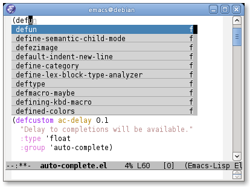
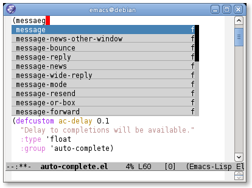
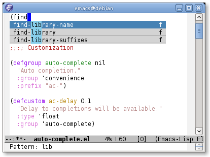

% Auto-Complete - An Intelligent auto-completion extension for Emacs

# What is Auto-Complete?

Auto-Complete is an intelligent auto-completion extension for
Emacs. It extends the standard Emacs completion interface and provides
an environment that allows users to concentrate more on their own
work.

# Features

* Visual interface
* Reduce overhead of completion by using statistic method
* Extensibility

# Screenshots

# Demo Video

* [YouTube](http://www.youtube.com/watch?v=rGVVnDxwJYE)

# Install

# User Manual

[Auto-Complete User Manual](http://cx4a.org/software/auto-complete/manual.html)

# Development

* <http://github.com/auto-complete/auto-complete>

# Reporting Bugs

Visit
[Auto-Complete Issue Tracker](https://github.com/auto-complete/auto-complete/issues)
and create a new issue.

License
-------

This software is distributed under the term of GPLv3.
